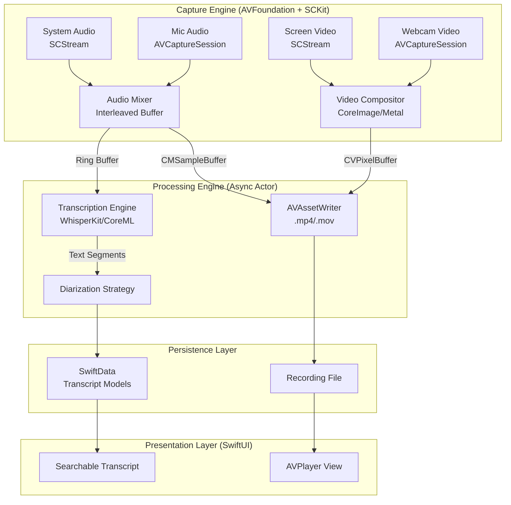

# macOS Native Meeting Transcription Architecture

## 1. Architecture Overview

This architecture utilizes a strictly native macOS 15 pipeline, leveraging `ScreenCaptureKit` for high-performance system audio/video capture and `AVFoundation` for microphone and webcam input. All AI processing (transcription and diarization) occurs locally using CoreML-optimized models (WhisperKit) or native Speech frameworks, ensuring privacy and zero dependencies on external runtimes like Python.

### High-Level Block Diagram



---

## 2. Audio/Video Capture Pipeline

### 2.1 Audio Strategy: Dual-Source Capture
To avoid virtual drivers (BlackHole), we treat System and Mic as distinct inputs and mix them in software before writing to disk or processing.

*   **System Audio:**
    *   **API:** `ScreenCaptureKit` > `SCStream`.
    *   **Configuration:** `SCStreamConfiguration` with `capturesAudio = true`.
    *   **Filter:** Use `SCContentFilter` to exclude the transcription app itself to prevent audio feedback loops.
    *   **Output:** `SCStreamOutput` provides `CMSampleBuffer` (PCM).
*   **Microphone Audio:**
    *   **API:** `AVCaptureSession` (for ease of clock sync) or `AVAudioEngine`.
    *   **Component:** `AVCaptureAudioDataOutput`.
    *   **Output:** `CMSampleBuffer` (PCM).

### 2.2 Synchronization & Mixing
Synchronization is the critical challenge when combining `SCStream` (driven by system display clock) and `AVCaptureSession` (driven by audio hardware clock).

1.  **Common Clock:** All `CMSampleBuffer` timestamps must be converted to `mach_absolute_time` or aligned via `CMClock`.
2.  **Buffering:** Implement a `CircularBuffer` or `AsyncStream`.
3.  **Alignment Strategy:**
    *   Read `sampleBuffer.outputPresentationTimeStamp` from both streams.
    *   Calculate the offset between the System Audio start time and Mic start time.
    *   Pad the earlier stream with silence samples so both streams mathematically align at `t=0` for the `AVAssetWriter`.
    *   **Mixing:** Combine raw PCM buffers (Float32) into a single stereo/mono track for transcription, or keep them as separate channels (Stereo L: System, R: Mic) to improve diarization accuracy (channel-based separation).

### 2.3 Video Compositing (Picture-in-Picture)
We will "burn in" the webcam video onto the screen recording in real-time using CoreImage, avoiding complex multi-track video files that are hard to share.

*   **Inputs:**
    *   Screen: `SCStream` -> `CMSampleBuffer` (Video).
    *   Webcam: `AVCaptureSession` -> `AVCaptureVideoDataOutput` -> `CMSampleBuffer`.
*   **Compositing Engine:**
    *   Create a `CIContext` (Metal-accelerated).
    *   For each frame from the Screen stream:
        1.  Fetch the latest available Webcam frame (closest timestamp).
        2.  Create `CIImage` from both buffers.
        3.  Apply `CILanczosScaleTransform` to the webcam image (scale down to ~20%).
        4.  Compose using `sourceOver` compositing (Webcam over Bottom-Right corner of Screen).
        5.  Render result to a new `CVPixelBuffer`.
*   **Encoding:**
    *   Pass the composited `CVPixelBuffer` to `AVAssetWriterInputPixelBufferAdaptor`.

---

## 3. AI/ML Strategy (On-Device)

### 3.1 Transcription (Speech-to-Text)
We will not use online APIs. We will use **WhisperKit**, an open-source Swift library optimized for CoreML on Apple Silicon.

*   **Library:** `WhisperKit` (by Argmax).
*   **Model:** `whisper-large-v3-turbo` (quantized) or `distil-whisper` depending on performance requirements.
*   **Implementation:**
    *   Initialize `WhisperKit` in a background `Task`.
    *   Feed accumulated audio buffers (15-30s chunks) from the "Mixing" stage into the transcription engine.
    *   Use VAD (Voice Activity Detection) provided by WhisperKit to avoid processing silence.

### 3.2 Speaker Diarization
Since we cannot bundle Python (Pyannote), we must use native heuristics or CoreML extensions.

*   **Strategy A (Channel Separation - High Accuracy):**
    *   If capturing System (Remote participants) and Mic (Local user), map them to separate audio channels (Left/Right) before processing.
    *   Tag segments based on channel origin:
        *   Channel 0 active = "Speaker: Me"
        *   Channel 1 active = "Speaker: Remote"
*   **Strategy B (Native Analysis):**
    *   Use `SNAudioStreamAnalyzer` (SoundAnalysis framework) to classify audio as speech vs. noise parallel to transcription.
    *   *Note:* True biometric speaker identification ("Who is speaking?") purely native without Python is complex. We will rely on **Channel Mapping** (Strategy A) as the primary reliable method for a "Meeting" app (Me vs. Them), which covers 90% of single-user meeting use cases.

---

## 4. Data Storage & Persistence

### 4.1 Media Storage
*   **Container:** `.mov` (QuickTime) or `.mp4`.
*   **Video Codec:** HEVC (H.265) for hardware acceleration and low file size.
*   **Audio Codec:** AAC (LC) at 128kbps+.

### 4.2 Transcript Storage
We will use **SwiftData** (persistent storage backed by SQLite) to store metadata and transcripts.

**Schema:**

```swift
@Model
class MeetingSession {
    var id: UUID
    var title: String
    var dateRecorded: Date
    var duration: TimeInterval
    var mediaFilePath: String // Relative URL
    
    @Relationship(deleteRule: .cascade) 
    var segments: [TranscriptSegment]
}

@Model
class TranscriptSegment {
    var startTime: TimeInterval
    var endTime: TimeInterval
    var text: String
    var speakerLabel: String // "Me", "System", or "Speaker 1"
    var session: MeetingSession?
}
```

### 4.3 Search
*   Use SwiftData's `#Predicate` macros to filter `TranscriptSegment` by text content.
*   Index the `text` property for performance.

---

## 5. Constraints Checklist Verification

| Constraint | Solution |
| :--- | :--- |
| **macOS 15+** | Utilizes `ScreenCaptureKit` and latest `SwiftData`. |
| **No Python** | Uses `WhisperKit` (CoreML) and Swift native logic. |
| **No Virtual Drivers** | Uses `SCStream` + `AVCaptureSession` dual-input mixing. |
| **Sync Audio** | Uses `CMClock` / `mach_absolute_time` alignment. |
